## Kylin快速安装

1、首先去官网下载对应安装包，http://kylin.apache.org/cn/download/。

2、下载完成后，将apache-kylin-3.0.1-bin-hbase1x.tar.gz上传到集群，并解压。

<font color=red>注意：需要在环境变量中添加HADOOP_HOME,HIVE_HOME,HBASE_HOME,可以到/etc/profile文件中修改，最后需要source 使添加的环境变量生效</font>

```bash
export HBASE_HOME=/home/hadoop/bs/hbase-1.3.1
export PATH=$PATH:$HBASE_HOME/bin
export HIVE_HOME=/home/hadoop/hive
export PATH=$PATH:$HIVE_HOME/bin
export HADOOP_HOME=/home/hadoop/hadoop-2.7.2
export PATH=$PATH:$HADOOP_HOME/bin
export PATH=$PATH:$HADOOP_HOME/sbin
```

3、启动kylin前，需要启动hdfs、yarn（还需启动historyserver）、zookeeper、hbase。(对应的部署在此不赘述，可以参考网上很多文章进行安装部署)（另外还需保证有hive，作为数据源）

4、利用命令`kylin.sh start` 启动kylin。

5、启动成功后，会看到命令行出现如下提示，接下来可以通过http://<hostname>:7070/kylin访问web界面。

```bash
A new Kylin instance is started by hadoop. To stop it, run 'kylin.sh stop'
Check the log at /home/hadoop/apache-kylin-2.5.1-bin-hbase1x/logs/kylin.log
Web UI is at http://<hostname>:7070/kylin
```

## 员工和部门简单kylin多维度分析例程

1、首先访问对应的web页面，可以看到如下，暂时没有任何工程、cube。

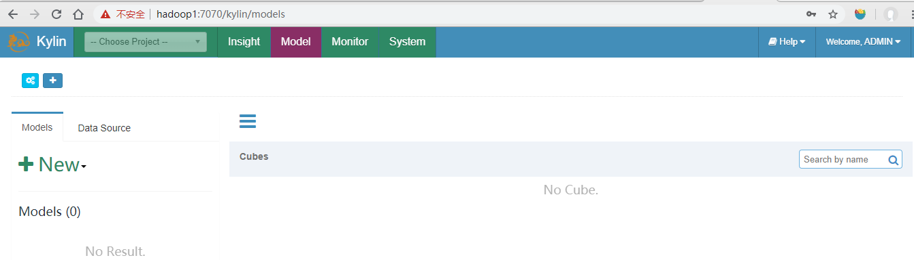

2、接下来我们访问hive，在hive中创建对应的部分和员工外部表，并将部分实验数据导入到表中。建表语句如下：

```sql
create external table if not exists default.dept(
deptno int,
dname string,
loc int
)
row format delimited fields terminated by '\t';

create external table if not exists default.emp(
empno int,
ename string,
job string,
mgr int,
hiredate string, 
sal double, 
comm double,
deptno int)
row format delimited fields terminated by '\t';

```

建表完成后导入数据，数据存放在txt文件中，load data local 将数据导入后，可以查看这些数据。

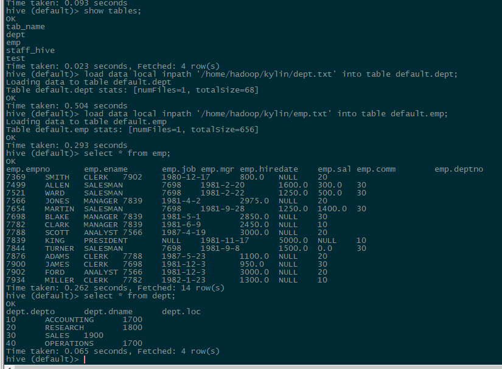

3、数据导入后，到web页面新建工程，工程名和描述按照自己的想法输入。

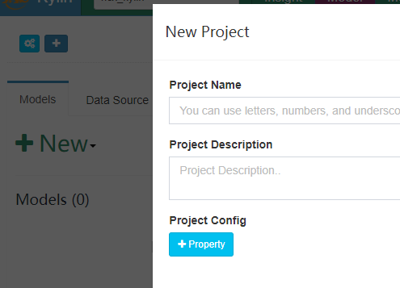

4、接下来设置数据源，可以选择Load table 或load table from tree，选择刚才创建并且有数据的两张表。设置完成后，我们可以在页面查看两张表的对应的元数据，可以查看表结构。

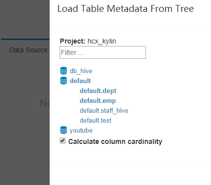

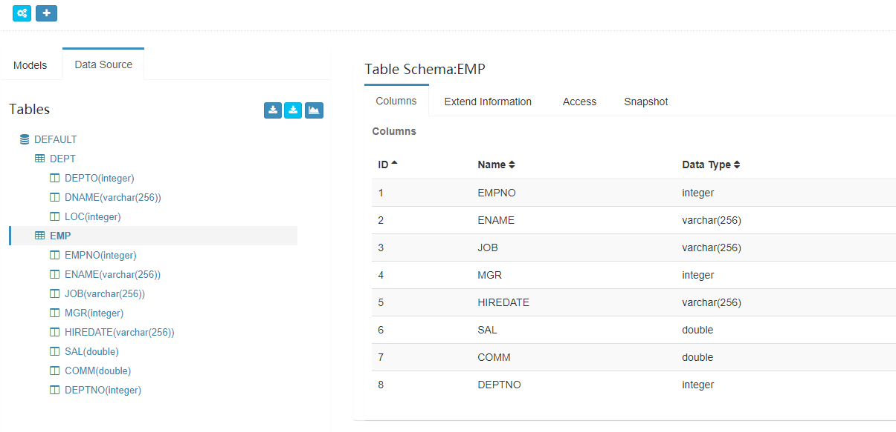

5、接下来，点击new  model，创建model，model名和描述也是按照自己的想法输入，在②数据模型这需要选择事实表，即星型模型的中心。另外还要点击add  lookup table添加维度表，在设置中需要增加事实表和维度表相连接字段。

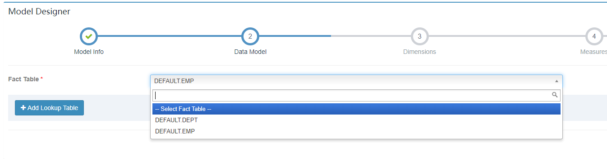

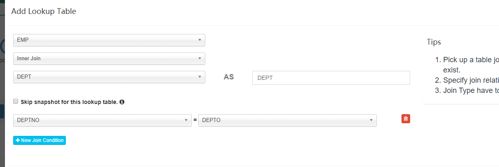

6、下一步，选择维度信息，即需要从哪几个维度进行分析，如下图选择员工表的职位、部门、经理和部门表的部门号、部门名称，5个维度对收入（sal）进行分析。

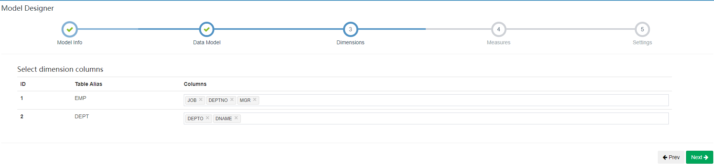

7、选择度量信息，即维度信息按不同维度进行分析，得到与度量的关系，如下选择工资（sal）。

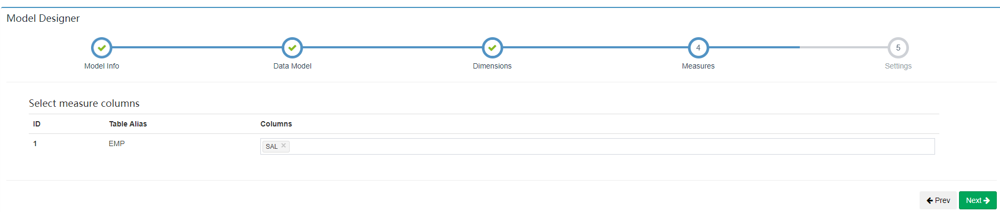

8、创建好model后，可以看到界面显示对应信息。

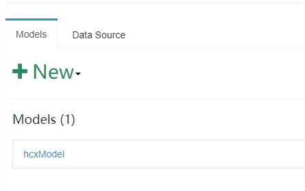

9、接下来创建cube，cube名称和描述按照自己想法写，下一步选择维度，需要注意的是，维度表中的字段可以选择normal和derived，normal是将选择的维度信息全部进行聚合，其生成的cuboid是2<sup>n</sup>-1 ,n表示维度的数量，可以看到如下图选择normal时，cuboid数量为31，而选择derived时，cuboid数量为7.这属于cube构建优化中的衍生维度。

衍生维度用于在有效维度内将维度表上的非主键维度排除掉，并使用维度表的主键（其实是事实表上相应的外键）来替代它们。Kylin会在底层记录维度表主键与维度表其他维度之间的映射关系，以便在查询时能够动态地将维度表的主键“翻译”成这些非主键维度，并进行实时聚合。

如下cuboid为7的图，维度表中的两个维度信息被记录为事实表中的外键，所以维度数量变成3个，cuboid 就 变成2^3-1=7。在一定程度上优化了cube构建时效率。但是衍生维度也不是完全替代normal模式，由于映射关系中会存在相同数据，导致分析出来的结果不是最终聚合完成的内容，还需要另外对结果再进行聚合操作。所以在选择时，需要考虑从维度表主键到某个维度表维度所需要的聚合工作量是否很大，大的话就不建议使用衍生维度。

在本次例程中可以选择derived模式。

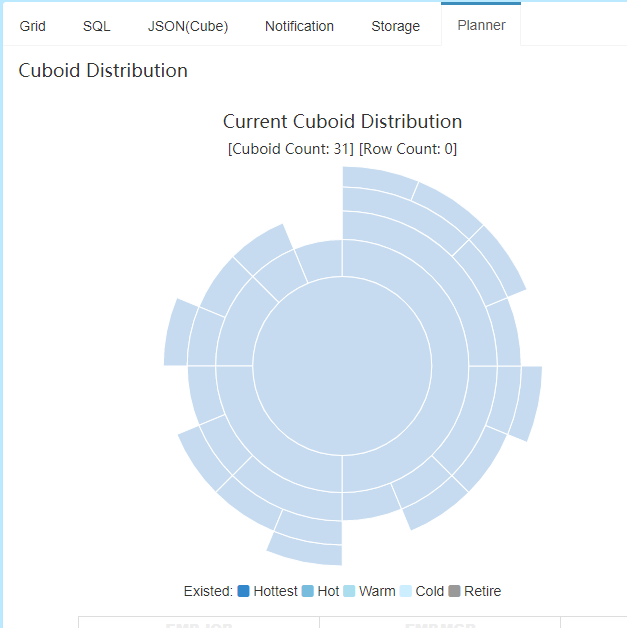

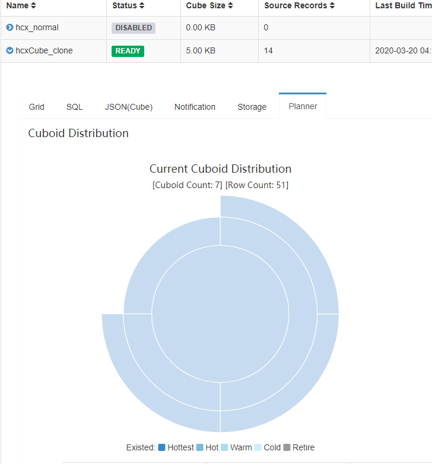

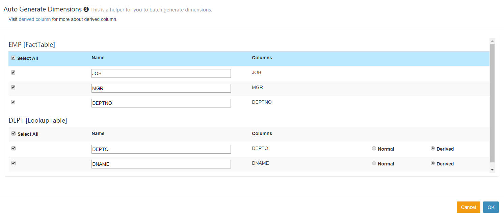

10、设置预计算的内容，默认有一个计算count，我们还可以增加，例如增加一个sum等等。填写完后不要忘记点击ok，将填写内容保存。

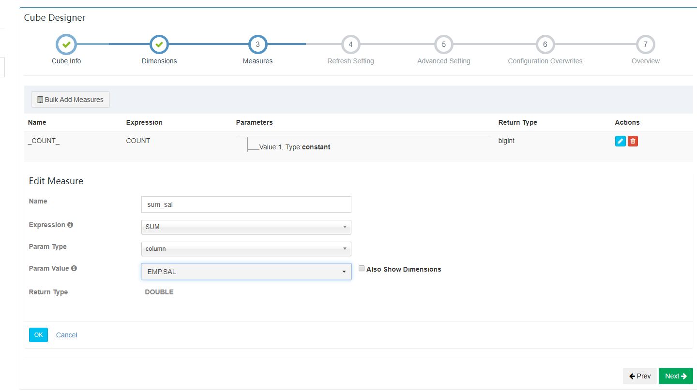

11、剩下的refresh setting是动态更新相关的内容，即当时间到达设置值时对内容进行归并。advanced setting是高级设置，可以设置聚合组等，聚合组也是cube构建优化，选择对应维度进行聚合绑定（强制维度、层级维度、联合维度），可以按照用户需求避免一些不需要的cuboid，适合基数很大的维度时使用，可以有效控制cube的膨胀率。configuration overwrite是配置覆盖设置，可以覆盖环境中的配置，使网页上需要的配置生效。

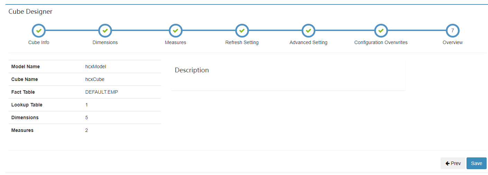

12、cube创建完成后，可以点击action ---> build，进行预计算了。我们可以点到Monitor查看进程运行状态，在这里也可以看到具体运行步骤和日志。

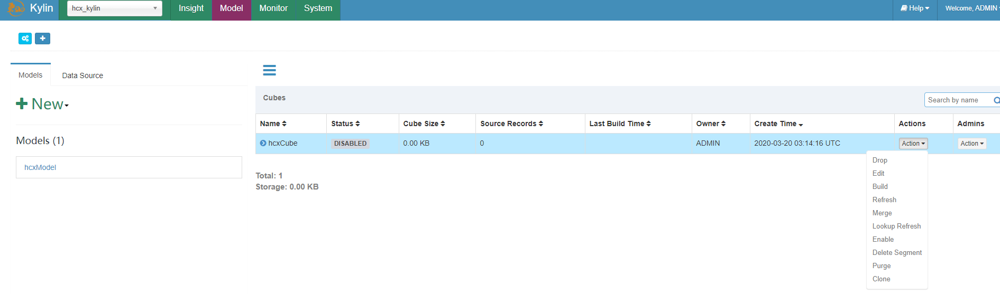

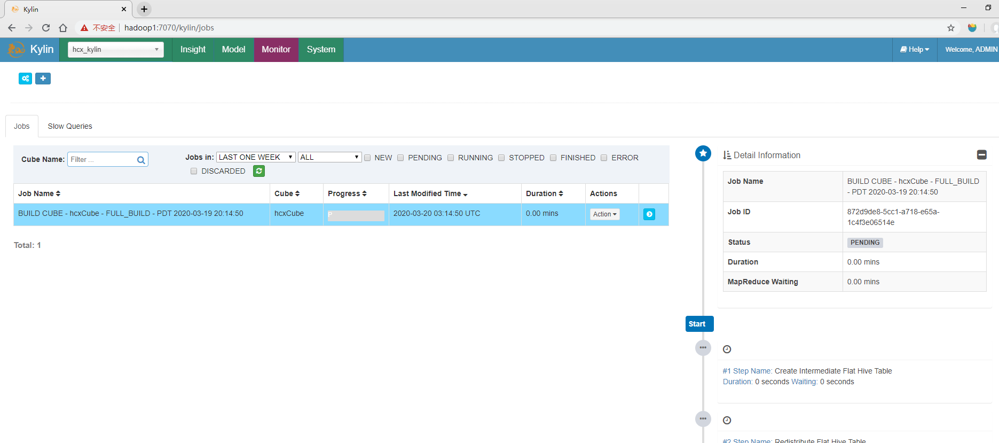

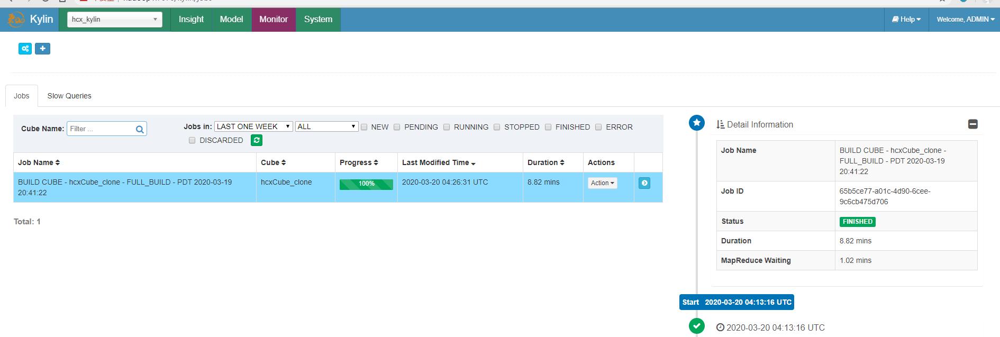

13、运行完成后，我们可以比较一下相同sql在hive和kylin中查询速度。如下图所示，可以看到聚合查询操作会先进行速度较慢的MapReduce，最后得到结果，查询时间为31秒。而在kylin页面查询，可以看到时间很短，为0.28秒，是因为预计算已经进行了MapReduce计算，省去了很多时间，而我们查询的时候直接查询HBase，速度就很快。

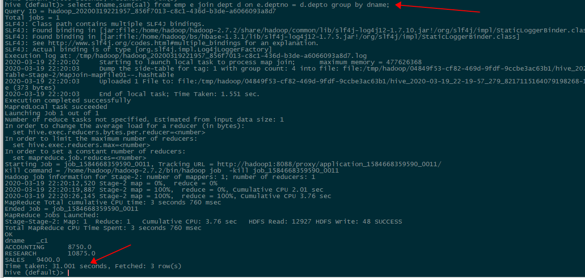

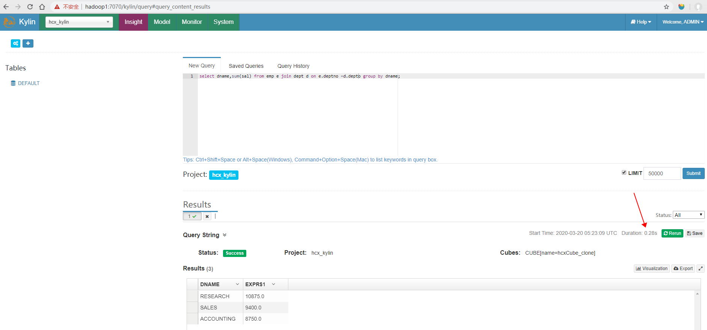

## Kylin结合Zeppelin工具

1、下载zeppelin工具。

2、下载完成后将压缩包上传到集群，并解压，然后切换到conf目录，将template模板配置文件修改名字，去除template后缀，可以对文件中内容进行修改，本次安装不做修改。

3、运行下面命令启动zeppelin。

```bash
[hadoop@hadoop1 bin]$ ./zeppelin-daemon.sh start
Zeppelin start                                             [  OK  ]
```

注意：如果出现如下错误，可以定位查看日志，logs/zeppelin-hadoop-hadoop1.out,如下，可以定位到是由于虚拟机内存不足，导致分配给jvm启动资源不足，导致应用无法启动。

```bash
[hadoop@hadoop1 zeppelin-0.8.0-bin-all]$ bin/zeppelin-daemon.sh start
Zeppelin start                                             [  OK  ]
Zeppelin process died                                      [FAILED]
```

```shell
 There is insufficient memory for the Java Runtime Environment to continue.
# Native memory allocation (mmap) failed to map 716177408 bytes for committing reserved memory.
# An error report file with more information is saved as:
# /home/hadoop/apache-kylin-2.5.1-bin-hbase1x/zeppelin-0.8.0-bin-all/hs_err_pid86405.log
ZEPPELIN_CLASSPATH: ::/home/hadoop/kylin/zeppelin-0.8.0-bin-all/lib/interpreter/*:/home/hadoop/kylin/zeppelin-0.8.0-bin-all/lib/*:/home/hadoop/kylin/zeppelin-0.8.0-bin-all/*::/home/hadoop/kylin/zeppelin-0.8.0-bin-all/conf
Java HotSpot(TM) 64-Bit Server VM warning: ignoring option MaxPermSize=512m; support was removed in 8.0
Java HotSpot(TM) 64-Bit Server VM warning: INFO: os::commit_memory(0x00000000c0000000, 716177408, 0) failed; error='Cannot allocate memory' (errno=12)
```

这时查看启动脚本，可以看到对应的jvm配置是在common.sh脚本中，ZEPPELIN_MEM默认配置初始化堆内存为1G，如果虚拟机未分配足够的内存，便后出现资源不足的问题，导致Zeppelin无法启动。问题找到了，我们修改一下堆大小就可以了，将1024改为512（结合自身虚拟机内存配置）。修改完成后，顺利启动，可以通过hadoop1:8080访问web页面。

```shell
# Text encoding for
# read/write job into files,
# receiving/displaying query/result.
if [[ -z "${ZEPPELIN_ENCODING}" ]]; then
  export ZEPPELIN_ENCODING="UTF-8"
fi

if [[ -z "${ZEPPELIN_MEM}" ]]; then
  export ZEPPELIN_MEM="-Xms1024m -Xmx1024m -XX:MaxPermSize=256m"
fi

if [[ -z "${ZEPPELIN_INTP_MEM}" ]]; then
  export ZEPPELIN_INTP_MEM="-Xms1024m -Xmx1024m -XX:MaxPermSize=512m"
fi

JAVA_OPTS+=" ${ZEPPELIN_JAVA_OPTS} -Dfile.encoding=${ZEPPELIN_ENCODING} ${ZEPPELIN_MEM}"
JAVA_OPTS+=" -Dlog4j.configuration=file://${ZEPPELIN_CONF_DIR}/log4j.properties"
export JAVA_OPTS
```

另外，在运行的时候也会出现类似错误，这个参数也是在common.sh，ZEPPELIN_INTP_MEM参数控制，解决办法也是如上述一致，修改对应堆大小就好。

```shell
# There is insufficient memory for the Java Runtime Environment to continue.
# Native memory allocation (mmap) failed to map 716177408 bytes for committing reserved memory.
# An error report file with more information is saved as:
# /home/hadoop/apache-kylin-2.5.1-bin-hbase1x/zeppelin-0.8.0-bin-all/hs_err_pid89070.log

	at org.apache.zeppelin.interpreter.remote.RemoteInterpreterManagedProcess.start(RemoteInterpreterManagedProcess.java:205)
	at org.apache.zeppelin.interpreter.ManagedInterpreterGroup.getOrCreateInterpreterProcess(ManagedInterpreterGroup.java:64)
	at org.apache.zeppelin.interpreter.remote.RemoteInterpreter.getOrCreateInterpreterProcess(RemoteInterpreter.java:111)
```

修改完成后，在zeppelin上配置好kylin访问project和rest  url后，即可利用该工具查询，同时zeppelin还集成了很多其他框架的查询，也可以通过配置后进行使用。

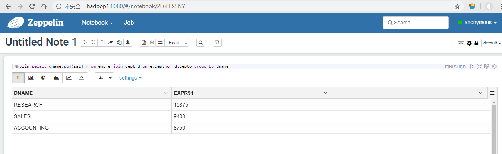

## kylin部署问题

```bash
2020-03-19 19:13:20,596 INFO  [main] zookeeper.ZooKeeper:438 : Initiating client connection,connectString=hadoop1:2181:2181,hadoop1:2181:2181,hadoop1:2181:2181 sessionTimeout=120000 watcher=org.apache.curator.ConnectionState@493dfb8e
2020-03-19 19:13:20,596 ERROR [main] imps.CuratorFrameworkImpl:546 : Background exception was not retry-able or retry gave up
java.net.UnknownHostException: hadoop1:2181: 域名解析暂时失败
```

出现上述问题的原因是在拼接connectString时，拼接了两次2181，导致连接错误。

原因就是在HBase的配置文件hbase-site.xml中，参数`hbase.zookeeper.quorum`设置了ip+端口号，在kylin连接zookeeper时，会再利用该参数值再拼接端口号2181，至此出现问题。

既然多了一个端口号，解决方法就按照要求去除一个端口号，可以修改hbase-site.xml，将`hbase.zookeeper.quorum`参数的value值的：2181去除。

```xml
<property>
	<name>hbase.zookeeper.quorum</name>
	<value>hadoop1,hadoop2,hadoop3</value>
</property>
```

```java
2020-03-19 21:14:48,286 ERROR [Scheduler 717691961 Job 305e13dc-8b20-f01b-316f-f7bacb10bfc5-60] common.HadoopJobStatusChecker:58 : error check status
java.io.IOException: java.net.ConnectException: Call From hadoop1/192.168.145.111 to 0.0.0.0:10020 failed on connection exception: java.net.ConnectException: Connection refused; For more details see:  http://wiki.apache.org/hadoop/ConnectionRefused
	at org.apache.hadoop.mapred.ClientServiceDelegate.invoke(ClientServiceDelegate.java:343)
	at org.apache.hadoop.mapred.ClientServiceDelegate.getJobStatus(ClientServiceDelegate.java:428)
```

在build  cube时，出现上述异常的原因是没有开启hadoop的job history服务。使用下面命令开启historyserver历史服务即可解决问题。

```bash
mr-jobhistory-daemon.sh start historyserver
```

